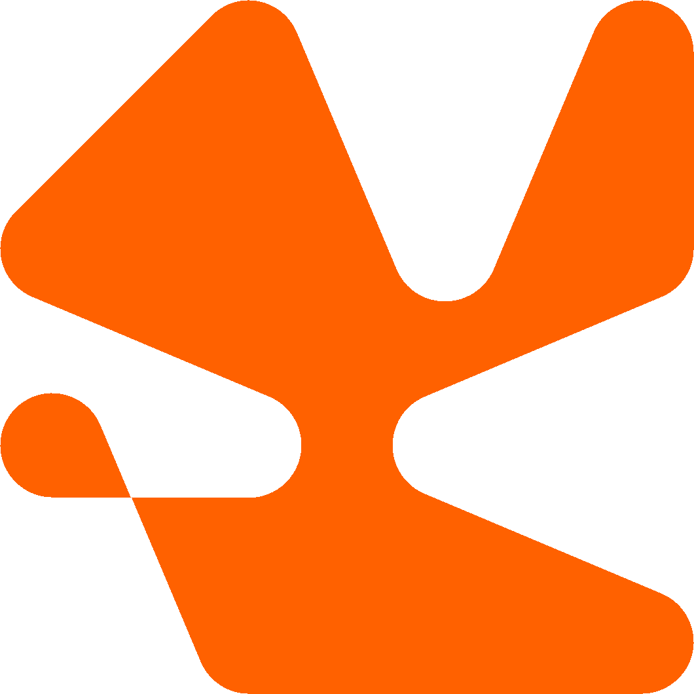

<h1 align="center">
  &nbsp;Physical Winding
</h1>

Interactive tribute to the organic composition technique of Armin Hofmann.

  &nbsp;
  &nbsp;
  

---

## About

**Physical Winding** is an interactive web experience based on the parametric and organic design principles from Armin Hofmann's *Graphic Design Manual*. 

**Strategic Features:**

- **Physical Tension Engine:** Calculates the exact exterior and interior common tangents between pins based on their radius and wrapping direction (Top/Bottom).
- **Anti-Crossing (Raycasting):** The string interacts with the physical geometry of the pins, locking at the correct angle instead of clipping through obstacles.
- **Smart Geometric Closure:** Transforms open line paths into pure convex or concave hulls by seamlessly connecting the last captured pin back to the first.
- **Professional Export:** High-resolution (2x) PNG export with a 100% transparent background, ideal for use in other graphic design workflows.

## Demo

  

<em>Weaving a string through the pin grid to create an organic convex hull</em>

## How the idea was born 

The concept emerged from the foundational "dot and line" exercises detailed in the early chapters of Armin Hofmann's *Graphic Design Manual* (1965). Specifically, Hofmann explores the relationship between points in a grid (often a four-by-four dot matrix) and how lines connect them to create organic movement and unified forms. In the pedagogical tradition of the Basel School of Design, these theories were often translated into tactile, analog exercises where students used physical pins and taut threads on a board to understand tension, negative space, and continuous curves. This project was born as an experiment to digitally recreate that exact analog constraint—translating the real-world resistance and tension of a thread into a dynamic, browser-based tool.

It allows the creation of perfectly smooth, filled shapes by weaving a line ("string") through a grid of pins (focal points). The system features a custom 2D physics engine that perfectly simulates the common tangents of a taut string between solid circles, ensuring the resulting shapes are pure vectors without unnatural artifacts or sharp corners.

## Quick Start

The application is fully hosted and ready to use in your browser. 

👉 **[Access Physical Winding Live](https://rouri404.github.io/armin-hofmann/)**

Since this is a purely **Vanilla** application, there are no build processes required. If you wish to contribute or run it locally, simply clone the repository and open `index.html` directly.
